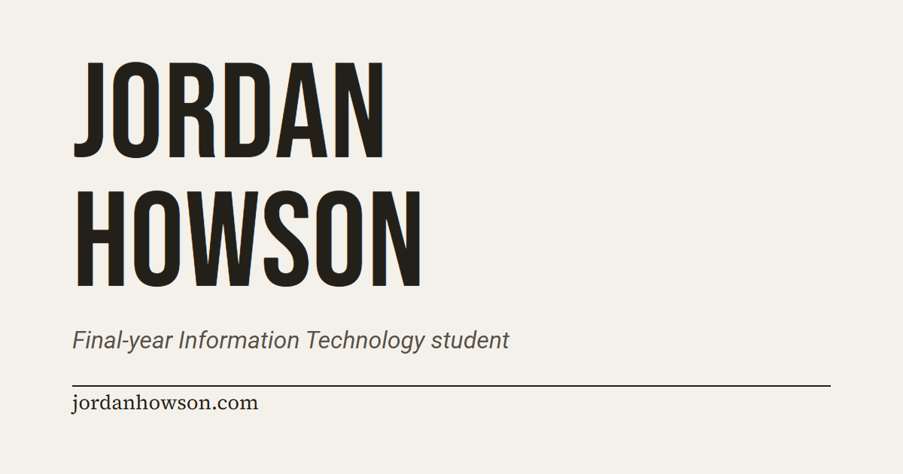

# Jordan Howson · Portfolio

My personal portfolio site. Hand-built and dependency-free: plain HTML, CSS, and a single vanilla JavaScript file, with self-hosted fonts.

No frameworks, no build step, and no third-party requests. Everything loads from one origin under a strict Content-Security-Policy, which keeps the attack surface small and the site quick.

Live at [jordanhowson.com](https://jordanhowson.com), on Cloudflare Pages.

## Generated assets

The CV uses the content in `index.html` and the print rules in `assets/css/styles.css`. After changing either, run `scripts/build-cv-pdf.ps1` on Windows to rebuild the two-page A4 PDF. It needs Python with `websocket-client` and a Chromium browser.

The social preview source is `scripts/social-card.html`. Serve the repository locally, open that page at a 1200 by 630 viewport, wait for the fonts to load, and capture it to `assets/og.png`. When replacing the image, update its version in the Open Graph and Twitter metadata in `index.html`.
